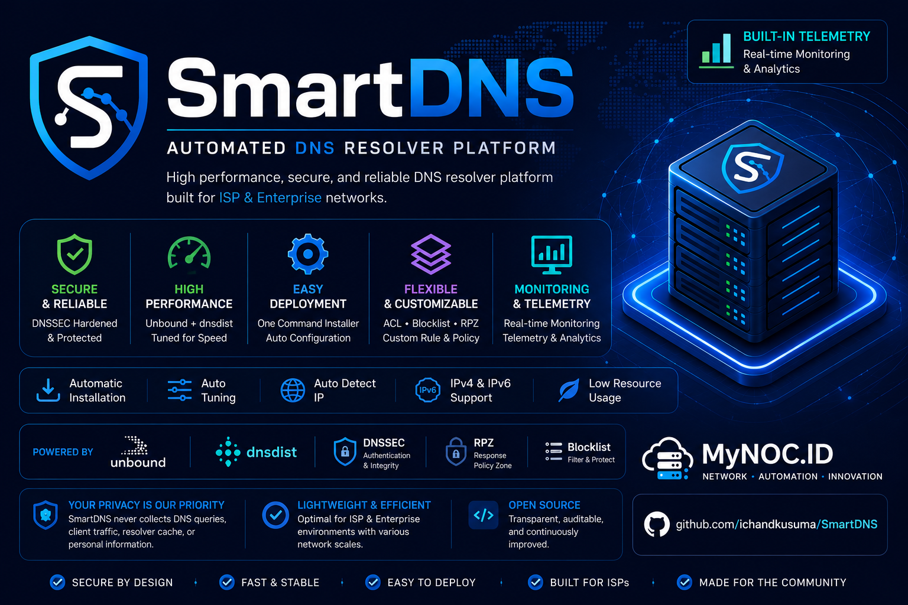

<!-- markdownlint-disable MD033 MD041 -->
<!--
CHANGELOG:
- Standardized variable expansion by consistently using ${VAR} across all shell
  scripts to improve readability, consistency, and safety.
- Fixed ShellCheck warnings.
- Corrected Markdown formatting errors.
- Added appropriate ShellCheck directives and disabled SC2312/SC2153/SC2034 where safe.
- Removed unused color variables and IPV6_INTERFACE assignments.
- Improved shebang declarations.
- Expanded OS support to Ubuntu 22.04, 24.04, 26.04 and Debian 11, 12, 13.
- Optimized package installation sequence to resolve port 53 bind conflicts.
- Corrected dynamic IPv6 frontend and backend rendering in dnsdist templates.
- Sourced LC_ALL=C locale execution for consistent English command output parsing.
- Improved telemetry UUID generation with stable kernel-based /proc/sys/kernel/random/uuid fallback.
- Pointed cron updater scheduler to permanent /opt/blocklist/update-blocklist.sh script.
-->

<div align="center">



# SmartDNS Optimized

## High Performance Recursive DNS Platform powered by Unbound and dnsdist

## Platform DNS Rekursif Kinerja Tinggi ditenagai oleh Unbound dan dnsdist

Developed and maintained by <a href="https://mynoc.id/" target="_blank">**MyNOC.ID**</a> & <a href="https://alsyundawy.com" target="_blank">**ALSYUNDAWY IT SOLUTION**</a>


</div>

---

## 🌎 Language / Bahasa

* [English](#english-documentation)
* [Bahasa Indonesia](#dokumentasi-bahasa-indonesia)

---

# English Documentation

## 📝 About

SmartDNS is an automated DNS Resolver Platform designed for **ISP**, **Enterprise**, **VPS**, and **Self-Hosted** environments.

Built around **Unbound** and **dnsdist**, SmartDNS automatically detects server hardware, calculates optimal performance settings, deploys a production-ready recursive DNS resolver, and configures supporting services with minimal user interaction.

Starting from **v1.0.0**, SmartDNS includes built-in telemetry and heartbeat monitoring to help manage installations and software versions.

## ⚡ Features

### Smart Installer

* **One-Command Installation**: Fully automated setup.
* **Automatic Hardware Detection**: Adapts configuration based on server specs.
* **Smart CPU & RAM Tuning**: Dynamically optimizes Unbound threads and cache slabs.
* **Recursive DNS Resolver (Unbound)**: Secure and fast recursion.
* **High Performance DNS Load Balancer (dnsdist)**: Distributes query load efficiently.
* **DNSSEC Validation**: Built-in verification for secure lookups.
* **DNS Packet Cache**: Speeds up response times.
* **IPv4 & IPv6 Dual-Stack Support**: Ready for modern network infrastructures.
* **DNS Blocklist (TrustPositif)**: Integrated ad and malicious domain blocklist.
* **Domain Whitelist**: Ensures critical domains bypass blocklists.
* **Domain Insecure Support**: Custom configurations for specific domains.
* **DNSDist Web Management**: Interactive web dashboard for monitoring.
* **Automatic Blocklist Update**: Daily cron jobs to keep domains fresh.
* **Automatic Health Check**: Pre-startup and post-install diagnostics.
* **Automatic Timezone & Hostname Configuration**: Localized setup.
* **Smart Scheduler**: Pre-configured optimized cron routines.
* **Interactive Installation Wizard**: Standard automated settings or customized installations.

### Monitoring & Telemetry

* **Automatic Heartbeat**: Pings server status every 5 minutes.
* **Built-in Telemetry**: System performance and tuning metrics.
* **Node Inventory**: Keeps track of deployment details.

## 📋 System Requirements

| Component | Minimum | Recommended |
| --- | --- | --- |
| **CPU** | 2 Cores | 4 Cores or Higher |
| **RAM** | 2 GB | 4 GB or Higher |
| **Storage** | 10 GB SSD | 15 GB SSD or Higher |
| **Network** | Public IPv4 | IPv4 + IPv6 Dual-Stack |
| **OS** | Ubuntu 22.04 LTS / Debian 12 | Ubuntu 22.04, 24.04, 26.04 / Debian 11, 12, 13 |
| **Root Access** | Required | Required |

## 🚀 Installation & Update

### Fresh Installation

```bash
git clone https://github.com/alsyundawy/SmartDNS.git
cd SmartDNS
bash install.sh
```

### Updating Existing Installation

Existing installations are automatically upgraded while preserving: UUID, Telemetry Data, Runtime Information, Configuration, and Schedulers.

```bash
cd SmartDNS
git pull
bash install.sh
```

---

# Dokumentasi Bahasa Indonesia

## 📝 Tentang

SmartDNS adalah Platform DNS Resolver otomatis yang dirancang untuk lingkungan **ISP**, **Enterprise**, **VPS**, dan **Self-Hosted**.

Menggunakan kombinasi **Unbound** dan **dnsdist**, SmartDNS secara otomatis mendeteksi perangkat keras server, menghitung pengaturan performa optimal, menyebarkan DNS resolver rekursif yang siap pakai, dan mengonfigurasi layanan pendukung dengan interaksi pengguna yang minimal.

Mulai dari versi **v1.0.0**, SmartDNS menyertakan telemetri bawaan dan pemantauan detak jantung (heartbeat) untuk membantu mengelola instalasi dan versi perangkat lunak.

## ⚡ Fitur Utama

### Smart Installer (Pemasang Pintar)

* **Instalasi Satu Perintah**: Pengaturan yang sepenuhnya otomatis.
* **Deteksi Perangkat Keras Otomatis**: Menyesuaikan konfigurasi berdasarkan spesifikasi server Anda.
* **Tuning CPU & RAM Pintar**: Mengoptimalkan thread Unbound dan cache slab secara dinamis.
* **Recursive DNS Resolver (Unbound)**: Rekursi cepat dan aman.
* **DNS Load Balancer Kinerja Tinggi (dnsdist)**: Mendistribusikan beban kueri secara efisien.
* **Validasi DNSSEC**: Verifikasi keamanan kueri bawaan.
* **DNS Packet Cache**: Mempercepat waktu respons kueri DNS.
* **Dukungan IPv4 & IPv6 Dual-Stack**: Siap untuk infrastruktur jaringan modern.
* **DNS Blocklist (TrustPositif)**: Integrasi pemblokiran domain iklan/berbahaya.
* **Daftar Putih Domain (Whitelist)**: Memastikan domain penting tidak terblokir.
* **Dukungan Domain Insecure**: Konfigurasi khusus untuk domain internal/tertentu.
* **Manajemen Web DNSDist**: Dasbor web interaktif untuk pemantauan.
* **Pemasangan Update Otomatis**: Pengaturan cron otomatis harian.
* **Pemeriksaan Kesehatan Otomatis**: Diagnostik pra-instalasi dan pasca-instalasi.
* **Konfigurasi Zona Waktu & Nama Host Otomatis**: Pengaturan lokal otomatis.
* **Penjadwal Pintar**: Rutinitas cron teroptimasi yang telah dikonfigurasi sebelumnya.
* **Wizard Instalasi Interaktif**: Pilihan pengaturan standar atau kustomisasi penuh.

### Pemantauan & Telemetry

* **Detak Jantung Otomatis**: Mengirimkan status server setiap 5 menit.
* **Telemetri Bawaan**: Metrik kinerja sistem dan data penyetelan parameter.
* **Inventaris Simpul (Node)**: Melacak rincian distribusi server.

## 📋 Persyaratan Sistem

| Komponen | Minimum | Direkomendasikan |
| --- | --- | --- |
| **CPU** | 2 Core | 4 Core atau Lebih Tinggi |
| **RAM** | 2 GB | 4 GB atau Lebih Tinggi |
| **Penyimpanan** | 10 GB SSD | 15 GB SSD atau Lebih Tinggi |
| **Jaringan** | IPv4 Publik | IPv4 + IPv6 Dual-Stack |
| **OS** | Ubuntu 22.04 LTS / Debian 12 | Ubuntu 22.04, 24.04, 26.04 / Debian 11, 12, 13 |
| **Akses Root** | Wajib | Wajib |

## 🚀 Pemasangan & Pembaruan

### Instalasi Baru

```bash
git clone https://github.com/alsyundawy/SmartDNS.git
cd SmartDNS
bash install.sh
```

### Memperbarui Instalasi yang Ada

Instalasi yang ada akan ditingkatkan secara otomatis tanpa menghapus: UUID, Data Telemetri, Informasi Runtime, Konfigurasi Saat Ini, dan Penjadwal.

```bash
cd SmartDNS
git pull
bash install.sh
```

---

## ⚙️ Service Ports / Port Layanan

| Service / Layanan | Port | Description / Deskripsi |
| --- | --- | --- |
| **DNS Resolver (dnsdist)** | 53 | Main Frontend / Port Utama |
| **Recursive Resolver (Unbound)** | 5300 | Local Recursion Backend / Backend Lokal |
| **DNSDist Web UI** | 8083 | Statistics & Console Web UI |

---

## 📂 Project Structure / Struktur Proyek

```text
SmartDNS/
├── cache/         # Temporarily saved environment state / Penyimpan status sementara
├── data/          # Databases & blocklist script / Basis data & skrip blocklist
├── docs/          # Documentation assets / Dokumen dan gambar pendukung
├── engine/        # Tuning & core configuration engines / Mesin utama konfigurasi & tuning
├── lib/           # Helper libraries / Pustaka pembantu sistem
├── output/        # Generated configuration outputs / Hasil file konfigurasi yang di-generate
├── scripts/       # Background scripts (heartbeat) / Skrip latar belakang
├── templates/     # Configuration templates / Templat konfigurasi dasar
├── VERSION        # Release version / Versi rilis
├── install.sh     # Installation entrypoint / Berkas utama instalasi
└── README.md      # Documentation / Dokumentasi ini
```

---

## 📌 Attribution & Credits / Atribusi & Kredit

### 👤 Original Creator / Pembuat Asli

* **Nama**: Ichan Kusuma (Chandra Kusuma Wibawa)
* **GitHub**: [ichandkusuma](https://github.com/ichandkusuma)
* **Project Original**: [SmartDNS](https://github.com/ichandkusuma/SmartDNS)
* **Blog**: [Kakiteng c Kusuma](https://kakiteng.blogspot.com)
* **Komunitas**: Toyota Etios Valco Club Indonesia (TEVCI) Riau & Kakiteng Community

### ⚡ Optimized & Refined By / Dioptimalkan & Disempurnakan Oleh

* **Nama**: Harry Dertin Sutisna Alsyundawy (alsyundawy)
* **GitHub**: [alsyundawy](https://github.com/alsyundawy)
* **Project Repository**: [SmartDNS Optimized](https://github.com/alsyundawy/SmartDNS)
* **Email**: `alsyundawy@gmail.com`
* **Telepon / Phone**: +62 856-8-515-212 / +62 812-9898-6464
* **Website**: [alsyundawy.com](https://alsyundawy.com)
* **Perusahaan / Author**: ALSYUNDAWY IT SOLUTION
* **Hak Cipta / CopyLeft**: 2022-2026 ALSYUNDAWY IT SOLUTION & Original Creator
* **Lisensi / License**: MIT License

---

## 📄 License & Disclaimer / Lisensi & Penyangkalan

Presented by [MyNOC.ID](https://mynoc.id/) | [ALSYUNDAWY IT SOLUTION](https://www.alsyundawy.com) - MIT License.

*Disclaimer: Proyek ini ditujukan untuk lingkungan edukasi, lab, enterprise, ISP, dan DNS self-hosted. Harap uji seluruh konfigurasi sebelum melakukan deploy di lingkungan produksi.*

---

<div align="center">

### ⭐ If SmartDNS helps your infrastructure, please consider giving this repository a Star

### ⭐ Jika SmartDNS membantu infrastruktur Anda, silakan berikan Star untuk repositori ini

Made with ❤️ in Indonesia by <a href="https://mynoc.id/" target="_blank">**MyNOC.ID**</a> & <a href="https://alsyundawy.com" target="_blank">**ALSYUNDAWY IT SOLUTION**</a>

</div>
