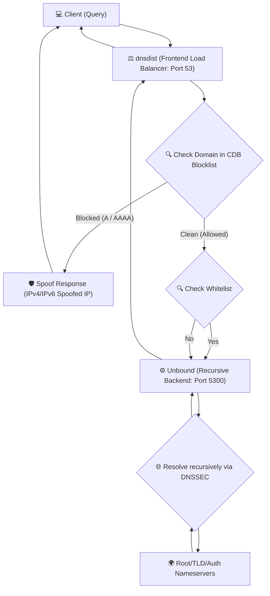
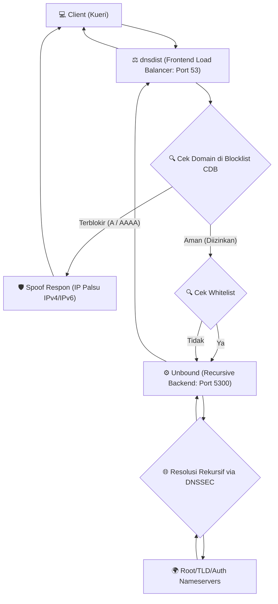

<!-- markdownlint-disable MD033 MD041 -->
<!--
CHANGELOG:
- Standardized variable expansion by consistently using ${VAR} across all shell
  scripts to improve readability, consistency, and safety.
- Fixed ShellCheck warnings.
- Corrected Markdown formatting errors.
- Added appropriate ShellCheck directives and disabled SC2312/SC2153/SC2034 where safe.
- Removed unused color variables and IPV6_INTERFACE assignments.
- Improved shebang declarations.
- Expanded OS support to Ubuntu 22.04, 24.04, 26.04 and Debian 11, 12, 13.
- Optimized package installation sequence to resolve port 53 bind conflicts.
- Corrected dynamic IPv6 frontend and backend rendering in dnsdist templates.
- Sourced LC_ALL=C locale execution for consistent English command output parsing.
- Improved telemetry UUID generation with stable kernel-based /proc/sys/kernel/random/uuid fallback.
- Pointed cron updater scheduler to permanent /opt/blocklist/update-blocklist.sh script.
-->

<div align="center">


# 🚀 SmartDNS Optimized

## High-Performance Recursive DNS Platform Powered by Unbound and dnsdist

## Platform DNS Rekursif Kinerja Tinggi Ditenagai oleh Unbound dan dnsdist

Developed and maintained by <a href="https://mynoc.id/" target="_blank">**MyNOC.ID**</a> & <a href="https://alsyundawy.com" target="_blank">**ALSYUNDAWY IT SOLUTION**</a>

---

[](https://github.com/alsyundawy/SmartDNS/releases)


[](https://github.com/alsyundawy/SmartDNS/releases)
[](https://github.com/alsyundawy/SmartDNS/)
[](https://github.com/alsyundawy/SmartDNS/blob/master/LICENSE)
[](https://github.com/alsyundawy/SmartDNS/issues)
[](https://github.com/alsyundawy/SmartDNS/pulls)
[](https://www.paypal.me/alsyundawy)
[](https://ko-fi.com/alsyundawy)
[](https://github.com/sponsors/alsyundawy)
[](https://github.com/alsyundawy/SmartDNS/network/members)
[](https://github.com/alsyundawy/SmartDNS/graphs/contributors)

---

### 🌎 Language / Bahasa

[English Documentation](#-english-documentation) • [Dokumentasi Bahasa Indonesia](#-dokumentasi-bahasa-indonesia)

</div>

---

# 🇺🇸 English Documentation

## 📝 About

SmartDNS is an automated, enterprise-grade DNS Resolver Platform designed for **ISPs**, **Enterprises**, **VPS providers**, and **Self-Hosted** environments.

By integrating **Unbound** and **dnsdist**, SmartDNS automatically:

1. Detects system hardware capabilities.
2. Calculates and configures optimized kernel and daemon parameters.
3. Deploys a secure, recursive DNS resolver backend.
4. Sets up a high-performance frontend load balancer with advanced blocklists.

Starting from **v1.0.0**, SmartDNS includes automated heartbeat health monitoring and secure telemetry reporting to simplify multi-node fleet management.

---

## 🎨 System Architecture

This diagram illustrates how queries flow through the platform:



---

## ⚡ Features

### Smart Installer

- **Zero-Touch Setup**: Fully automated one-command installation.
- **Hardware-Aware Tuning**: Dynamically adjusts Unbound thread counts, slab allocations, TCP queues, and cache sizes based on available CPU cores and RAM.
- **Unbound Recursive Backend**: Secure DNSSEC validation, hardened query settings, and strict access controls.
- **dnsdist Frontend Load Balancer**: Blazing fast query routing, packet caching, and request distribution.
- **TrustPositif Blocklist Integration**: Local domain database converted into tinycdb (CDB) format for microsecond-level query filtering and custom A/AAAA spoofing.
- **Resilient Environment Controls**: Resolves port 53 binding conflicts on systemd-resolved systems safely.
- **Resolve Host Configuration**: Automatically registers `127.0.1.1 SmartDNS` in `/etc/hosts` to ensure local hostname resolution succeeds on every boot.
- **Dual-Stack IPv4/IPv6**: Native compatibility with modern networks.
- **Interactive Customization**: Fast default configuration or customizable install options (spoof IPs, ports, and passwords).

### Telemetry & Maintenance

- **Heartbeat Scheduler**: Cron-based health check reporting status every 5 minutes.
- **Autonomous Updater**: Automated daily database sync for ad and malware blocklists.
- **DNSDist Web UI Console**: Dedicated admin monitoring dashboard.

---

## 📋 System Requirements

| Component      | Minimum Specification        | Recommended Specification                      |
| -------------- | ---------------------------- | ---------------------------------------------- |
| **CPU**        | 2 Cores                      | 4 Cores or Higher                              |
| **RAM**        | 2 GB                         | 4 GB or Higher                                 |
| **Storage**    | 10 GB SSD                    | 15 GB SSD or Higher                            |
| **Network**    | Public IPv4                  | IPv4 + IPv6 Dual-Stack                         |
| **OS**         | Ubuntu 22.04 LTS / Debian 12 | Ubuntu 22.04, 24.04, 26.04 / Debian 11, 12, 13 |
| **Privileges** | Root / sudo                  | Root / sudo                                    |

---

## 🚀 Installation & Update

### Fresh Installation

```bash
git clone https://github.com/alsyundawy/SmartDNS.git
cd SmartDNS
bash install.sh
```

### Upgrading an Existing Installation

Upgrades are completely non-destructive and retain: UUID, configuration parameters, telemetry files, and custom scheduler tasks.

```bash
cd SmartDNS
git pull
bash install.sh
```

---

# 🇮🇩 Dokumentasi Bahasa Indonesia

## 📝 Tentang

SmartDNS adalah Platform DNS Resolver otomatis kelas enterprise yang dirancang untuk lingkungan **ISP**, **Enterprise**, **VPS**, dan **Self-Hosted**.

Melalui integrasi **Unbound** dan **dnsdist**, SmartDNS secara otomatis:

1. Mendeteksi kapasitas perangkat keras sistem secara real-time.
2. Menghitung dan mengonfigurasi parameter kernel dan daemon yang optimal.
3. Menyebarkan backend resolver rekursif yang tangguh dan aman.
4. Memasang load balancer frontend berkinerja tinggi lengkap dengan fitur blocklist lanjutan.

Mulai dari versi **v1.0.0**, SmartDNS menyertakan pemantauan detak jantung (heartbeat) otomatis dan laporan telemetri yang aman guna menyederhanakan pengelolaan server multi-node.

---

## 🎨 Arsitektur Sistem

Diagram berikut menunjukkan bagaimana kueri DNS diproses oleh platform:



---

## ⚡ Fitur Utama

### Smart Installer (Pemasang Pintar)

- **Instalasi Instan**: Pengaturan otomatis penuh hanya dengan satu baris perintah.
- **Penyetelan Berbasis Perangkat Keras**: Mengonfigurasi jumlah thread Unbound, alokasi slab cache, antrean TCP, dan memori cache berdasarkan jumlah CPU core dan kapasitas RAM.
- **Backend Rekursif Unbound**: Validasi DNSSEC bawaan, perlindungan pengerasan kueri, dan pembatasan akses jaringan (ACL) yang aman.
- **Frontend Load Balancer dnsdist**: Perutean kueri super cepat, caching paket, dan distribusi beban.
- **Integrasi Blocklist TrustPositif**: Database domain lokal dikonversi ke format tinycdb (CDB) untuk penyaringan super cepat dan teknik spoofing A/AAAA otomatis.
- **Resolusi Konflik Port 53**: Mengatasi masalah bentrok port binding dengan systemd-resolved pada OS modern secara aman.
- **Konfigurasi Resolve Host**: Mendaftarkan `127.0.1.1 SmartDNS` ke `/etc/hosts` secara otomatis agar hostname lokal dapat di-resolve dengan benar setiap kali sistem boot.
- **Dukungan Dual-Stack**: Berjalan lancar di lingkungan IPv4 maupun IPv6.
- **Kustomisasi Wizard**: Pilihan pemasangan otomatis standar atau mode kustom (pengaturan IP spoof, port, dan kata sandi).

### Telemetri & Pemeliharaan

- **Penjadwal Heartbeat**: Pengiriman metrik kesehatan dan status server otomatis setiap 5 menit.
- **Pembaruan Mandiri**: Sinkronisasi database blocklist iklan dan malware harian melalui cron job.
- **Dasbor Web UI dnsdist**: Konsol manajemen web interaktif untuk memantau performa.

---

## 📋 Persyaratan Sistem

| Komponen        | Spesifikasi Minimum          | Spesifikasi Rekomendasi                        |
| --------------- | ---------------------------- | ---------------------------------------------- |
| **CPU**         | 2 Core                       | 4 Core atau Lebih Tinggi                       |
| **RAM**         | 2 GB                         | 4 GB atau Lebih Tinggi                         |
| **Penyimpanan** | 10 GB SSD                    | 15 GB SSD atau Lebih Tinggi                    |
| **Jaringan**    | IP Publik IPv4               | Dual-Stack IPv4 + IPv6                         |
| **OS**          | Ubuntu 22.04 LTS / Debian 12 | Ubuntu 22.04, 24.04, 26.04 / Debian 11, 12, 13 |
| **Akses**       | Akses root / sudo            | Akses root / sudo                              |

---

## 🚀 Pemasangan & Pembaruan

### Pemasangan Baru

```bash
git clone https://github.com/alsyundawy/SmartDNS.git
cd SmartDNS
bash install.sh
```

### Memperbarui Sistem yang Ada

Proses pembaruan tidak akan merusak konfigurasi berjalan dan tetap mempertahankan: UUID node, parameter kustom, file telemetri, serta tugas penjadwalan cron.

```bash
cd SmartDNS
git pull
bash install.sh
```

---

## ⚙️ Service Ports / Port Layanan

| Service / Layanan                | Port | Description / Deskripsi                             |
| -------------------------------- | ---- | --------------------------------------------------- |
| **DNS Resolver (dnsdist)**       | 53   | Main Frontend / Port Utama                          |
| **Recursive Resolver (Unbound)** | 5300 | Local Recursion Backend / Backend Lokal             |
| **DNSDist Web UI**               | 8083 | Statistics & Console Web UI / UI Statistik & Konsol |

---

## 📂 Project Structure / Struktur Proyek

```text
SmartDNS/
├── cache/         # Temporarily saved environment state / Penyimpan status sementara
├── data/          # Databases & blocklist script / Basis data & skrip blocklist
├── docs/          # Documentation assets / Dokumen dan gambar pendukung
├── engine/        # Tuning & core configuration engines / Mesin utama konfigurasi & tuning
├── lib/           # Helper libraries / Pustaka pembantu sistem
├── output/        # Generated configuration outputs / Hasil file konfigurasi yang di-generate
├── scripts/       # Background scripts (heartbeat) / Skrip latar belakang
├── templates/     # Configuration templates / Templat konfigurasi dasar
├── VERSION        # Release version / Versi rilis
├── install.sh     # Installation entrypoint / Berkas utama instalasi
└── README.md      # Documentation / Dokumentasi ini
```

---

## 🔧 Useful Commands / Perintah Berguna

### Restart Services / Menjalankan Ulang Layanan

```bash
systemctl restart unbound
systemctl restart dnsdist
```

### Check Service Status / Memeriksa Status Layanan

```bash
systemctl status unbound
systemctl status dnsdist
```

### Perform DNS Lookups / Pengujian Resolusi DNS

```bash
dig @127.0.0.1 google.com
dig @::1 google.com
```

### Validate Config / Validasi Konfigurasi

```bash
unbound-checkconf
dnsdist --check-config
```

### Trigger Heartbeat / Menjalankan Heartbeat Manual

```bash
/usr/local/bin/smartdns-heartbeat
```

### Inspect Configuration Environments / Memeriksa Konfigurasi Lingkungan

```bash
cat /var/lib/smartdns/install.json
cat /var/lib/smartdns/install.env
cat cache/secret.env
```

### View Schedulers / Memeriksa Jadwal Cron

```bash
cat /etc/cron.d/smartdns
cat /etc/cron.d/smartdns-heartbeat
```

---

## 📡 Telemetry / Telemetri

SmartDNS sends secure heartbeat payloads every **5 minutes** to help keep track of node versions and system health.

**Data collected / Data yang dikumpulkan:**

- Node metadata (Product version, UUID, Operating System, Kernel, Uptime).
- Hardware stats (Architecture, CPU model, Thread count, Total RAM, Virtualization provider).
- Network config (Public IP addresses, IPv6 availability status).
- Activated features (DNSSEC validation, IPv6 capability, Rate limiting, Query logging).
- Calculated smart tuning parameters.

> [!NOTE]
> SmartDNS **does not** collect DNS query histories, user traffic packets, resolver cache entries, or any sensitive personal information.

---

## 📌 Attribution & Credits / Atribusi & Kredit

### 👤 Original Creator / Pembuat Asli

- **Nama**: Ichan Kusuma (Chandra Kusuma Wibawa)
- **GitHub**: [ichandkusuma](https://github.com/ichandkusuma)
- **Project Original**: [SmartDNS](https://github.com/ichandkusuma/SmartDNS)
- **Blog**: [Kakiteng c Kusuma](https://kakiteng.blogspot.com)
- **Komunitas**: Toyota Etios Valco Club Indonesia (TEVCI) Riau & Kakiteng Community

### ⚡ Optimized & Refined By / Dioptimalkan & Disempurnakan Oleh

- **Nama**: Harry Dertin Sutisna Alsyundawy (alsyundawy)
- **GitHub**: [alsyundawy](https://github.com/alsyundawy)
- **Project Repository**: [SmartDNS Optimized](https://github.com/alsyundawy/SmartDNS)
- **Email**: `alsyundawy@gmail.com`
- **Telepon / Phone**: +62 856-8-515-212 / +62 812-9898-6464
- **Website**: [alsyundawy.com](https://alsyundawy.com)
- **Perusahaan / Author**: ALSYUNDAWY IT SOLUTION
- **Hak Cipta / CopyLeft**: 2022-2026 ALSYUNDAWY IT SOLUTION & Original Creator
- **Lisensi / License**: MIT License

---

## 📄 License & Disclaimer / Lisensi & Penyangkalan

Presented by [MyNOC.ID](https://mynoc.id/) | [ALSYUNDAWY IT SOLUTION](https://www.alsyundawy.com) - MIT License.

_Disclaimer: Proyek ini ditujukan untuk lingkungan edukasi, lab, enterprise, ISP, dan DNS self-hosted. Harap uji seluruh konfigurasi sebelum melakukan deploy di lingkungan produksi._

---

<div align="center">

### ⭐ If SmartDNS helps your infrastructure, please consider giving this repository a Star

### ⭐ Jika SmartDNS membantu infrastruktur Anda, silakan berikan Star untuk repositori ini

Made with ❤️ in Indonesia by <a href="https://mynoc.id/" target="_blank">**MyNOC.ID**</a> & <a href="https://alsyundawy.com" target="_blank">**ALSYUNDAWY IT SOLUTION**</a>

</div>
